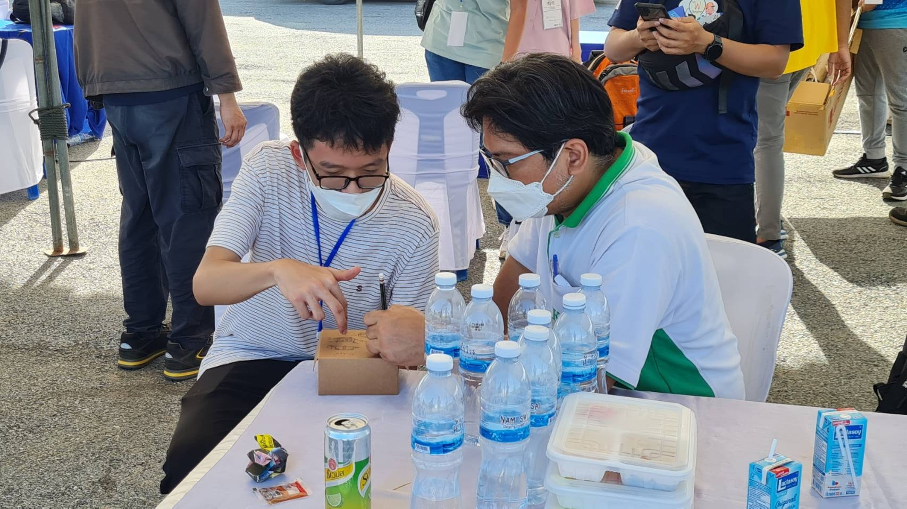

# Rocket Optimization Project Overview

## Introduction

The project's success hinges on Mr. Phachara Phumiprathet's help in setting a new goal: winning an aerodynamics award in the Thailand CANSAT-ROCKET Competition 2022. Recognizing the initial goals were too challenging, our team is adjusting them for better chances. My responsibility is to design the rocket for our team, "Nuage," in this competition.

## Methodology

I started using OpenRocket to enhance the rocket's performance. I aimed to increase its altitude by tweaking the nose cone's shape and length. Strangely, OpenRocket suggested a short, blunt nose cone. I was skeptical, but when I double-checked with Aerolab, the results matched. It seemed strange, going against what we knew about physics.

Digging deeper, I found that pressure drag was a big factor. It indicated that a shorter nose cone, up to 12 cm, would work better. So, we went with a von Karman-style nose cone of that length to reduce resistance.

Mr. Wisit Wipudgasamsook also recommended striking the right balance between static margin and altitude, so I get a 2 cm tip chord length, influencing the design of the fins. Adhering to the competition's requirement of 4 fins, my design decisions were not only in compliance but also geared towards ensuring the rocket's balance and optimal performance.

## Conclusion 

During the presentation before the launch, the committees weren't sure about the simulation results showing an altitude of 652 m. They thought it was too high since the given rocket from DTI was supposed to reach a maximum of 600 m. I double-checked everything in my simulations but found no issues.

In the end, my rocket reached 577 m, which didn't match the simulation result, but it was still the highest. The result of all this work is that our rocket got the Best Aerodynamics Award from the Thailand CanSat Rocket Competition 2022.

This GitHub page details the steps we took to optimize the rocket. We're working closely with Mr. Phachara Phumiprathet and Mr. Wisit Wipudgasamsook to give our rocket a strong chance in the competition.

The images provided were captured by Vivatsathorn Thitasirivit, Nattakit Kwankitpisarn, Thanyapisit Kangsathien, Arkkanirut Pandej, and were sourced from a Facebook post by Dr. Rattapol Sakornsin.

