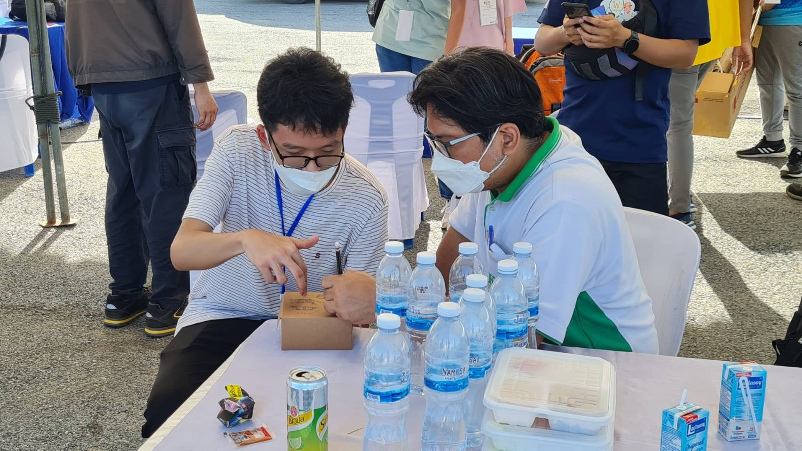

# Rocket Optimization Project Overview

## Introduction

The Thailand CANSANT-ROCKET Competition, organized by the National Science Museum (NSM) and the Defence Technology Institute (DTI), invites high school students to design and test CanSats and rockets. For the rocket part, students don't have to create their own rocket motor, with the total impulse of 255 Ns, as DTI has it covered.

This GitHub page displays our rocket project for Team Nuage, the winner of the Aerodynamics Award at the Thailand CANSAT-ROCKET Competition 2022. Thanks to Phachara Phumiprathet's guidance, we've set a more realistic goal within our time constraints. My role is to design the rocket for our team in this competition.

## Methodology

I started using rocket optimization feature of OpenRocket to increase its altitude by tweaking the nose cone's shape and length. Strangely, OpenRocket suggested a short, blunt nose cone. I was skeptical, but when I double-checked with Aerolab, the results matched. It seemed strange, going against what we knew about physics.

Digging deeper, I found pressure drag was a big factor. So, I went with a von Kármán-style nose cone of with the length of 12 cm to lower pressure drag without adding the weight that comes with a longer nose cone.

Wisit Wipudgasamsook also recommended striking the right balance between static margin and altitude, so I get a 2 cm tip chord length, influencing the design of the fins. Adhering to the competition's requirement of 4 fins, my design decisions were not only in compliance but also geared towards ensuring the rocket's balance and optimal performance.

Following my design process, Shinakrit Laokittichai proceeded to assemble the rocket components in preparation for launch.

## Conclusion 

During the presentation before the launch, the committees weren't sure about the simulation results showing an altitude of 652 m. They thought it was too high since the given rocket motor from DTI was supposed to reach a maximum of 600 m. I double-checked everything in my simulations but found no issues.

In the end, my rocket reached 577 m, which didn't match the simulation result (deviate 12%), but it was still the highest. The result of all this work is that our rocket got the Best Aerodynamics Award from the Thailand CanSat Rocket Competition 2022.

The images provided were captured by Vivatsathorn Thitasirivit, Nattakit Kwankitpisarn, Thanyapisit Kangsathien, Arkkanirut Pandej, and were sourced from a Facebook post by Dr. Rattapol Sakornsin.

